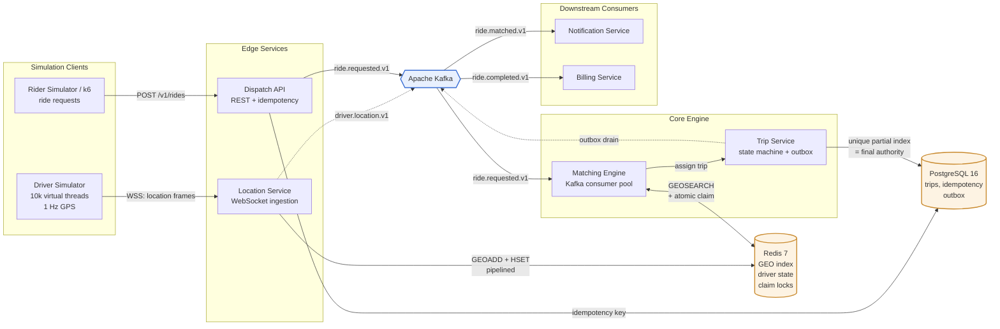
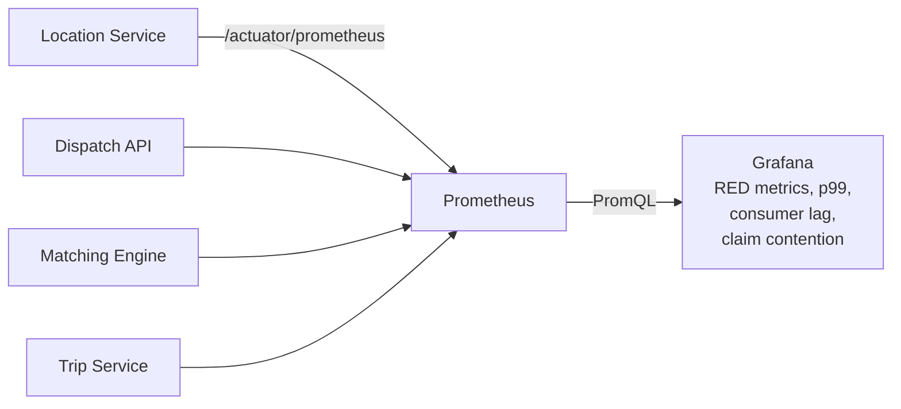
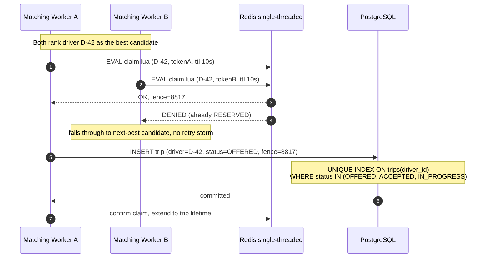
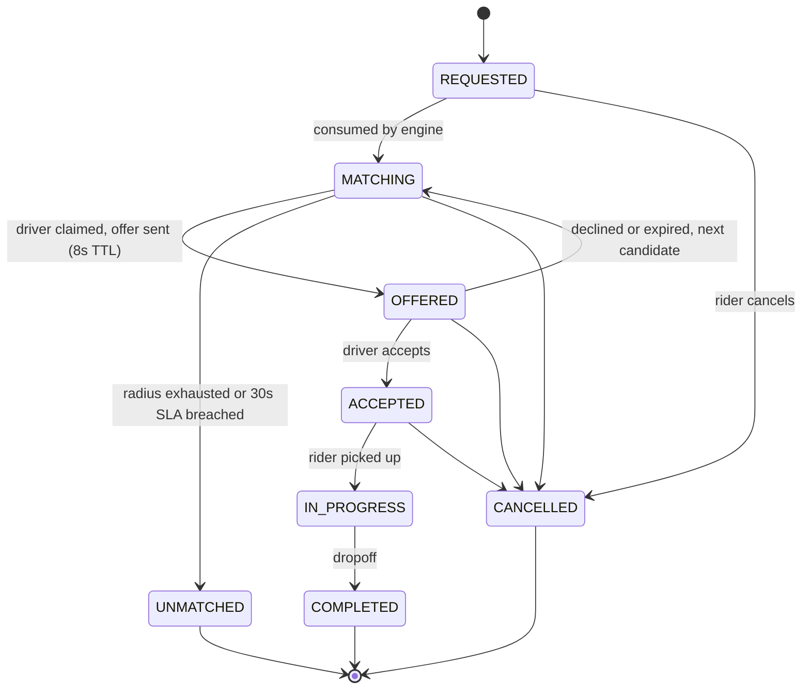

# Real-Time Ride-Matching Engine

A production-shaped, event-driven dispatch backend in **Java 25**: it ingests high-frequency GPS
streams from thousands of drivers over WebSockets, indexes them geospatially in Redis, and matches
riders to the nearest available driver — **guaranteeing that no driver is ever assigned to two rides**,
even under thousands of concurrent requests.

There is no UI. The deliverable is the system: the architecture, the concurrency guarantees, the
Kafka topology, and the load-test evidence that it holds up.

| | |
|---|---|
| **Language / Runtime** | Java 25 LTS (virtual threads), Spring Boot 4.1 |
| **Geospatial index** | Redis 7 (`GEOADD` / `GEOSEARCH`) |
| **System of record** | PostgreSQL 16 |
| **Event backbone** | Apache Kafka (KRaft) |
| **Observability** | Micrometer → Prometheus → Grafana, OpenTelemetry traces |
| **Testing** | JUnit 5, Testcontainers, k6 load harness |
| **Infra** | Podman + Dev Containers — the host needs no JDK, Maven, or database |

---

## Target SLOs

These are the numbers the system is designed and load-tested against, not aspirations:

| Metric | Target |
|---|---|
| Location ingest throughput | 10,000 updates/sec (10k drivers @ 1 Hz) |
| Location ingest latency (p99) | < 50 ms |
| Ride request → driver matched (p99) | < 500 ms |
| Ride request API latency (p99) | < 120 ms (enqueue-only; matching is async) |
| Double-assignment rate | **0** — enforced structurally, not probabilistically |
| Sustained ride requests | 500 req/sec |

---

## System Architecture



Metrics and traces are a separate plane, deliberately kept out of the data-flow picture above:



**Flow in one paragraph.** Drivers hold a WebSocket and push a GPS frame every second. The Location
Service pipelines those into a Redis geospatial index (and mirrors them onto a short-retention Kafka
topic for analytics) — this path never touches Postgres. A rider POSTs a ride request; the Dispatch
API validates the idempotency key, persists the request, and returns `202 Accepted` immediately. The
Matching Engine consumes the request off Kafka, runs a `GEOSEARCH` for candidates within the radius,
ranks them, and attempts an **atomic claim** on the best candidate. The Trip Service writes the
assignment to Postgres, where a unique partial index makes a double-assignment physically impossible.
The resulting `ride.matched` event fans out via the transactional outbox to notification and billing,
which are fully decoupled from the request path.

---

## The Three Hard Problems

### 1. Geospatial indexing at write-heavy load

10,000 drivers at 1 Hz is 10,000 writes/sec — a workload that punishes a B-tree-and-vacuum database.
Redis's `GEOADD` is a sorted-set insert on a 52-bit geohash: O(log N), in-memory, no write
amplification. `GEOSEARCH ... BYRADIUS 3.2 km ASC COUNT 20` returns ranked candidates in sub-millisecond
time.

Write volume is further reduced at the edge: a location frame is only persisted if the driver moved
more than 25 m, or 3 s have elapsed since the last write, and writes are pipelined in batches. PostGIS
is kept in the design for what it is actually good at — geofences, zone analytics, historical trip
queries — not for the hot path.
→ [ADR-0002](docs/adr/0002-redis-geo-over-postgis.md)

### 2. Concurrency: never assign one driver to two rides

This is the core of the project, and it is solved in **two layers** rather than by trusting a lock:



- **Layer 1 — Redis Lua CAS (fast path).** A single Lua script does compare-and-set on the driver's
  status hash. Redis executes scripts atomically on a single thread, so the check and the set cannot
  interleave. Losers are rejected in one round trip and immediately move to the next candidate
  instead of spinning.
- **Layer 2 — Postgres unique partial index (the actual guarantee).** `UNIQUE (driver_id) WHERE
  status IN ('OFFERED','ACCEPTED','IN_PROGRESS')`. Even if Redis loses its state, a lock expires
  mid-flight, or a network partition splits the workers, the database *cannot* store two active trips
  for one driver. Correctness lives where the durable state lives.
- **Fencing tokens.** Each claim carries a monotonic `INCR` token. A worker that stalled past its
  lease and wakes up late writes a stale token and is rejected — the failure mode that plain
  distributed locks silently allow.

**On Redlock:** deliberately not used. Redlock's safety argument depends on bounded clock drift and
bounded GC pauses, and it offers no protection against a lease expiring while the holder is still
working (see Kleppmann's critique). Treating the Redis claim as a *contention optimizer* and the
database constraint as the *correctness boundary* is the honest design.
→ [ADR-0004](docs/adr/0004-driver-claim-concurrency.md)

### 3. Event-driven decoupling without losing events

The request path publishes and returns; matching, notification, and billing all happen off the
critical path. Kafka delivery is **at-least-once**, so every consumer is made idempotent (dedupe on
event ID) — no claim of exactly-once semantics that the system does not actually provide.

Producing to Kafka and committing to Postgres cannot be one atomic operation, so state-changing
events go through a **transactional outbox**: the trip write and the outbox row commit together, and
a publisher drains the outbox. No lost events, no phantom events.
→ [ADR-0003](docs/adr/0003-kafka-topology-and-outbox.md)

**Topic topology**

| Topic | Key | Partitions | Retention | Purpose |
|---|---|---|---|---|
| `driver.location.v1` | `driverId` | 12 | 1 h | Telemetry mirror / analytics |
| `ride.requested.v1` | `rideId` | 12 | 7 d | Work queue for the matching engine |
| `ride.matched.v1` | `rideId` | 12 | 7 d | Fan-out to notification + billing |
| `ride.unmatched.v1` | `rideId` | 6 | 7 d | No driver found within the SLA window |
| `ride.completed.v1` | `rideId` | 12 | 7 d | Billing trigger |
| `*.dlt` | — | 3 | 30 d | Dead letters after retry exhaustion |

Keying by `rideId` guarantees per-ride ordering; keying location by `driverId` guarantees a driver's
positions are never reordered.

---

## Idempotency

`POST /v1/rides` requires an `Idempotency-Key` header. The key, a hash of the request body, and the
eventual response are stored in Postgres with a 24-hour TTL:

| Situation | Response |
|---|---|
| First request with this key | `202 Accepted`, work enqueued |
| Retry, original still in flight | `409 Conflict` + `Retry-After` |
| Retry, original completed | `200 OK` — the **stored** original response, replayed |
| Same key, *different* body | `422 Unprocessable Entity` — key reuse is a client bug |

The insert is `INSERT ... ON CONFLICT DO NOTHING`, so the race between two simultaneous retries is
resolved by the database, not by a read-then-write check that has a window between the two.
→ [ADR-0005](docs/adr/0005-idempotency.md)

---

## Trip Lifecycle



Every transition is guarded server-side; illegal transitions are rejected rather than silently
tolerated, and each one emits a domain event.

---

## Repository Layout

Hexagonal (ports and adapters) — domain logic has zero framework imports and is unit-testable without
Redis, Kafka, or Postgres running.

```
ride-matching-engine/
├── .devcontainer/               # JDK 25 + Maven sandbox (VS Code attaches here)
├── docs/
│   ├── ARCHITECTURE.md          # deep system design
│   ├── LOAD_TESTING.md          # methodology + results
│   └── adr/                     # architecture decision records
├── services/
│   ├── location-service/        # WebSocket ingestion -> Redis GEO
│   ├── dispatch-api/            # REST, idempotency, request intake
│   ├── matching-engine/         # Kafka consumers, ranking, claims
│   ├── trip-service/            # trip state machine, Postgres, outbox
│   ├── notification-service/    # downstream consumer (decoupling proof)
│   └── billing-service/         # downstream consumer (fan-out proof)
├── libs/
│   ├── domain/                  # pure domain model + ports (no Spring)
│   ├── events/                  # versioned event schemas
│   └── platform/                # observability, Kafka/Redis config
├── simulator/                   # driver + rider simulation harness
├── loadtest/                    # k6 scenarios
├── ops/
│   ├── docker-compose.yml
│   ├── prometheus/
│   └── grafana/                 # provisioned dashboards (committed as JSON)
└── README.md
```

Each service module is internally structured as:

```
domain/          entities, value objects, invariants  — no frameworks
application/     use cases, port interfaces           — orchestration only
adapters/in/     REST controllers, WS handlers, Kafka consumers
adapters/out/    Redis, Postgres, Kafka producer implementations
```

→ [ADR-0001](docs/adr/0001-hexagonal-architecture.md)

---

## Observability

Every service exposes `/actuator/prometheus`. The committed Grafana dashboard tracks:

The dashboard is committed as JSON and provisioned automatically, so the panels a reviewer sees
are the panels the load test was judged against — not something reconstructed by hand afterwards.

- **RED metrics** per endpoint — rate, errors, duration (p50 / p95 / p99)
- `matching_duration_seconds` — request-to-match end-to-end histogram
- `match_success_ratio` and `match_attempts_per_ride` — dispatch quality
- `driver_claim_contention_total` — how often two workers targeted the same driver
- `kafka_consumer_lag` per group — the real backpressure signal
- `redis_geo_query_duration_seconds` and active driver pool size by status

Structured JSON logs carry a trace ID propagated across HTTP → Kafka → consumer, so a single ride can
be reconstructed end-to-end.

---

## Load Testing

`loadtest/` drives the system with k6 while the simulator holds thousands of live driver WebSockets.
Headline scenario: **10,000 concurrent drivers streaming at 1 Hz plus 5,000 concurrent rider
requests**, with the Grafana dashboard captured under load.

Correctness is asserted, not eyeballed: after every run a verification query confirms that zero
drivers hold more than one active trip.

→ [docs/LOAD_TESTING.md](docs/LOAD_TESTING.md)

---

## Running It

The project develops inside a **Dev Container**, so the only things needed on the host are VS Code
and Podman — no JDK, no Maven, no database installs. Open the folder in VS Code and choose *Reopen in
Container*.

Infrastructure only — Postgres, Redis, Kafka (KRaft):

```bash
podman compose -f ops/docker-compose.yml up -d
```

The whole system, including all six services and the observability stack:

```bash
./mvnw package -DskipTests && podman compose -f ops/docker-compose.yml --profile app --profile observability up -d --build
```

Grafana at `localhost:3000` (anonymous, dashboard pre-provisioned), Prometheus at `localhost:9090`,
dispatch API at `localhost:8080`.

The jars are built before the images rather than inside them: a multi-stage build would recompile
the whole reactor once per service, and the jar is a build artifact, not a source input.

Full setup and troubleshooting: **[docs/DEV_ENVIRONMENT.md](docs/DEV_ENVIRONMENT.md)**.

*Implementation in progress — the architecture above is the contract the code is being built against.*

---

## Architecture Decision Records

| ADR | Decision |
|---|---|
| [0001](docs/adr/0001-hexagonal-architecture.md) | Hexagonal architecture, multi-module Maven |
| [0002](docs/adr/0002-redis-geo-over-postgis.md) | Redis GEO for the hot path, PostGIS for analytics |
| [0003](docs/adr/0003-kafka-topology-and-outbox.md) | Kafka topology, at-least-once + transactional outbox |
| [0004](docs/adr/0004-driver-claim-concurrency.md) | Two-layer driver claim; why not Redlock |
| [0005](docs/adr/0005-idempotency.md) | Idempotency keys on ride creation |
| [0006](docs/adr/0006-java21-virtual-threads.md) | Java 21 virtual threads over a reactive stack |
| [0007](docs/adr/0007-containerized-dev-environment.md) | Dev Container on Podman; compose siblings, not Docker-in-Docker |
| [0008](docs/adr/0008-dependency-currency.md) | Track supported dependency versions; the Spring Boot 4 upgrade |

Full design detail: **[docs/ARCHITECTURE.md](docs/ARCHITECTURE.md)**
